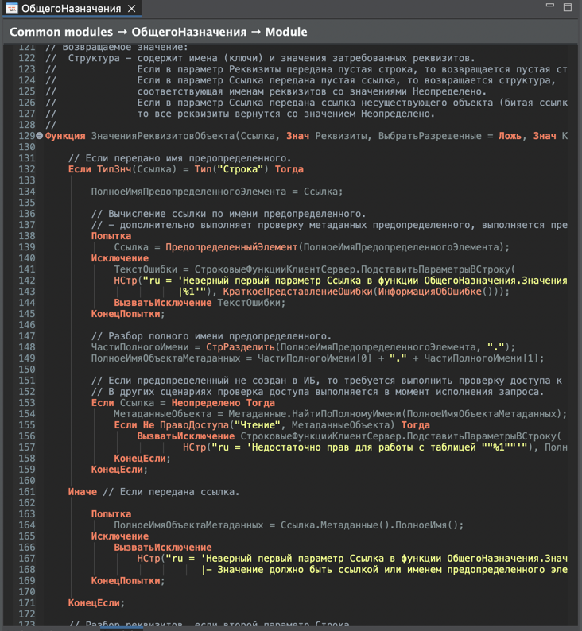

## Indent-Guide Plugin for 1C:EDT & Eclipse

### Описание

Плагин добавляет настраиваемые полоски отступов в текстовых редакторах 1C:EDT и Eclipse.

<figure>

</figure>

### Настройки

Страница настроек расположена:

> **`Window`&rarr;`General`&rarr;`Editors`&rarr;`Text Editors`&rarr;`Indent Guide`**

<figure>
	
</figure>

### Сайт обновлений

https://github.com/marmyshev/indent-guide/releases

### License

MIT

### The IndentGuide Authors

- IBM Corporation
- Anton Leherbauer (Wind River Systems)
- atlanto          (github.com/atlanto)
- kiritsuku        (github.com/kiritsuku)
- Roman Dawydkin   (github.com/tanmatra)
- GRosenberg       (github.com/grosenberg)
