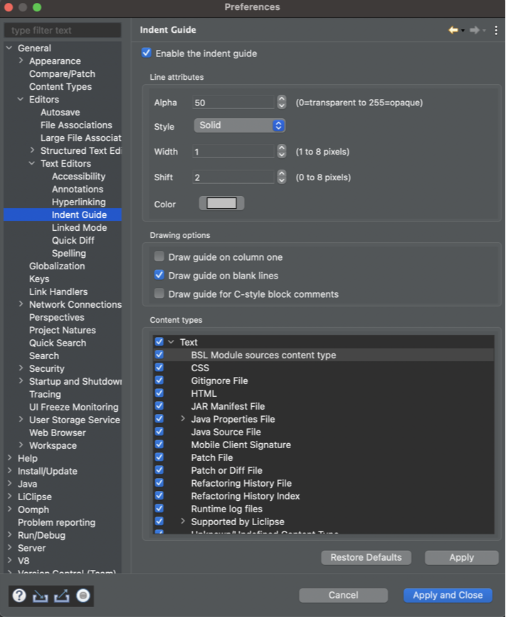

## IndentGuide Plugin for Eclipse

### Description

Adds configurable indent guide lines in Eclipse text editors.

<figure>
<figcaption><u>IndentGuide Example</u></figcaption>

</figure>

### Preferences

The preference page can be found at 

> **`Window`&rarr;`General`&rarr;`Editors`&rarr;`Text Editors`&rarr;`Indent Guide`**

<figure>
<figcaption><u>IndentGuide Preference Page</u></figcaption>

</figure>

### Update Site

https://www.certiv.net/updates

### License

MIT

### The IndentGuide Authors

- IBM Corporation
- Anton Leherbauer (Wind River Systems)
- atlanto          (github.com/atlanto)
- kiritsuku        (github.com/kiritsuku)
- Roman Dawydkin   (github.com/tanmatra)
- GRosenberg       (github.com/grosenberg)
